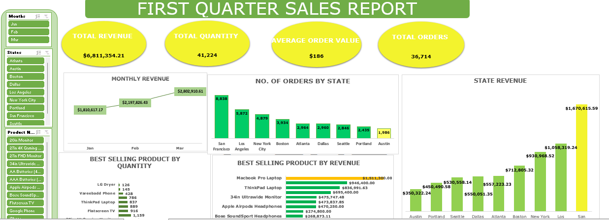

## SALES ANALYSIS
    By Janet Minaseidiema
---

### Project Overview

This project aims at analyzing the first quarter sales data of the year to find insights and patterns. The analysis involves data cleaning, exploratory data analysis and visualization.

---
### Problem Statement
The goal of this data analysis project is to analyze the first quarter sales data of the year in order to identify trends, give insights and data-driven recommendations that can guide business strategies. I will be using the provided dataset to answer the following business questions;

1. Which Month has the highest revenue? 
2. Which product is the best selling in terms of quantity and
revenue? 
3. What is the AOV(average order value)? 
4. Which state did we get the most number of orders from? 
5.  Which state is generating the highest number of revenue?
---

### Data Source
The primary dataset used for this analysis was gotten from [Sales_Data_Qtr_1](https://kaggle.com), a csv file with three worksheets containing detailed information.

 - Sales Data Qrt 1

 - Location

 - Products
---

### Tool
- Excel [Download here](https://microsoft.com)
---

### Skills Demonstrated

Before I began the analysis process, the following tasks were performed;

1. Data loading and inspection.

2. Handling missing values.

3. Data cleaning and formatting.

4. Removing Duplicates.

I was also able to use advanced excel formulas like the XLOOKUP function to join my worksheets in other to answer the business questions efficiently

---

### Exploratory Data Analysis and Visualization
This project contains one report page.

### Findings

Looking at our performance from the first quarter sales we can see that; the month of March contributed the highest revenue. The sales team did a great work which led to a remarkable result. However, January lagged behind in terms of revenue. We have to analyze the reasons behind this and strategize for improvement in the coming months.
Also, San Francisco has the highest number of orders. The marketing team is working exceptionally. On the other hand, Austin had the fewest orders. There is need to explore opportunities to boost sales in San Francisco.
Our AAA batteries were the best-selling product by quantity, with 6,036 quantities sold. This demonstrates strong demand and customer satisfaction. Unfortunately, the LG dryer had the lowest sales volume, with only 126 quantities sold. An evaluation of marketing and positioning for this product should be done. 
San Francisco again generated the highest revenue of over a million-dollars. While Austin generated the least revenue of over $350,000. There is need for targeted efforts to boost sales in this market.
The Macbook Pro laptop is the best selling product by revenue generating over a million dollars in revenue. This product therefore deserves continued focus. In contrast, AAA batteries generated the least revenue of $18,000. We can explore ways to enhance their profitability.

### Recommendations

